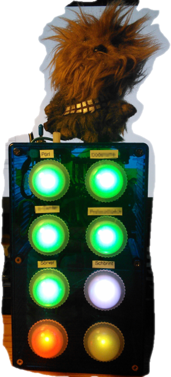

# Tschenggins Lämpli (ESP8266 IoT Jenkins CI Lights/Beacon/Build Status Indicator)

by Philippe Kehl <flipflip at oinkzwurgl dot org>,
https://oinkzwurgl.org/projaeggd/tschenggins-laempli

See [user_docu.h](src/user_docu.h) for details.

Say `make help` for help on building the firmware, documentation, etc.

The colours indicate the result (success, warning, failure, unknown) and the the
LEDs pulsate while jobs are running. Chewie roars if something goes wrong (red,
failure) and he whistles the Indiana Jones theme when things go back to green
(success) again.
