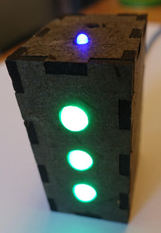

# Tschenggins Lämpli (ESP8266 IoT Jenkins CI Lights/Beacon/Build Status Indicator)

by Philippe Kehl <flipflip at oinkzwurgl dot org>,
https://oinkzwurgl.org/projaeggd/tschenggins-laempli

Note: There is an ESP32 version of the firmware at https://github.com/phkehl/gitta.

## Introduction

This is a Jenkins (jobs) status indicator. It uses RGB LEDs to indicate the
build status. The colours indicate the result (success, warning, failure,
unknown) and the the LEDs pulsate while jobs are running. It can use WS2801 or
SK9822/APA102 LEDs. Chewie roars if something goes wrong (red, failure) and he
whistles the Indiana Jones theme when things go back to green (success) again.

The setup for watching the Jenkins jobs status is slightly different from many
other similar projects. Instead of accessing the Jenkins (API) directly from the
client, it connects to a custom backend to obtain the current status and changes
of the status of the jobs.

he backend is a simple CGI script (in Perl, of course ;-). The status updates
work almost real-time by pushing the information to the client (the Lämpli)
withouth special stuff, such as web sockets or the like. It "abuses" HTTP by
running the CGI script endlessly (or as long as the web server or the
connectivity allows). The script keeps sending data to the client (hearbeats,
status updates), which should keep things going for hours in most setups
(incl. many shared hosting services).

In parallel, a second scripts runs on the Jenkins server. It watches the Jenkins
jobs for changes in the status and pushes those to the webserver (where the CGI
script is watching for changes to the data). The data is kept in a single-file
"database" (a JSON file). The watcher script does not use the Jenkins API
either, but instead watches the job's output diretories for changes. This allows
for the near real-time status updates (as opposed to polling the Jenkins API
every now and then).

This also allows making things work in a setup where the (client) wireless
network is separate from the (Jenkins) server network. For example in a company
the wireless network may only allow public internet access and the client would
not be able to connect to the Jenkins server directly. And running a VPN client
on the ESP8266 would be challenging, or impossible. In this case the backend can
live in the internet, which is reachable from the wireless and the server
networks.

The backend can be (should be!) a https server. In this case the server
certificate will be checked by the software. There is no option to bypass the
server certificate check.

Interested hackers may find useful code for their projects here. There is an
implementation of buffered and non-blocking debug output (uses interrupts and
the UART hardware FIFO, drops output if the buffer is full) in `src/debug.c`
([API](src/debug.h)). Tones and melodies can be played with `src/tone.c`
([API](src/tone.h)). Or a nice monitor task (prints memory usage, task list and
CPU usage, etc.) in [`src/mon.c`](src/mon.c). Or the WS2801 and SK9822/APA102
LED drivers (using interrupt driven, buffered, non-blocking SPI) in
`src/leds.c`. Or perhaps one of the utility routines, such as stringification
for various ESP SDK enumerators and status codes, in `src/stuff.c`
([API](src/stuff.h)).

## Building

This uses the [esp-open-rtos](https://github.com/SuperHouse/esp-open-rtos) and
the toolchain from [esp-open-sdk](https://github.com/pfalcon/esp-open-sdk). An
old version using only the esp-open-sdk can be found in the `old/` sub-directory.

To prepare the build environment:

1. Symlink your `/path/to/esp-open-sdk` here:

   `ln -s /path/to/esp-open-sdk esp-open-sdk`

2. Symlink your `/path/to/esp-open-rtos` here:

   `ln -s /path/to/esp-open-rtos esp-open-rtos`

Alternatively you can set `SDKBASE` and `RTOSBASE` in your `local.mk` file.

To configure your build:

1. Copy `config-sample.mk` to `config.mk` and edit it (see also _Backend Server Setup_ below).

To build run:

* `make`.

To flash run:

* `make flash`.

To watch the debug output run:

* `make debug`.

If the software doesn't flash or run try different parameters for
`FLASH_MODE`, `FLASH_SPEED` etc. (see the `Makefile`).

See `make help` and `make info` for more information.

## Backend Server Setup

- Install the `tools/tschenggins-status.pl` as a CGI script on some web server. This will need
  `Linux::Inotify2` (`sudo apt install liblinux-inotify2-perl`).
- Run the `tools/tschenggins-watcher.pl` script on the Jenkins server to monitor the Jenkins jobs
  and point it to the location of the CGI script.

